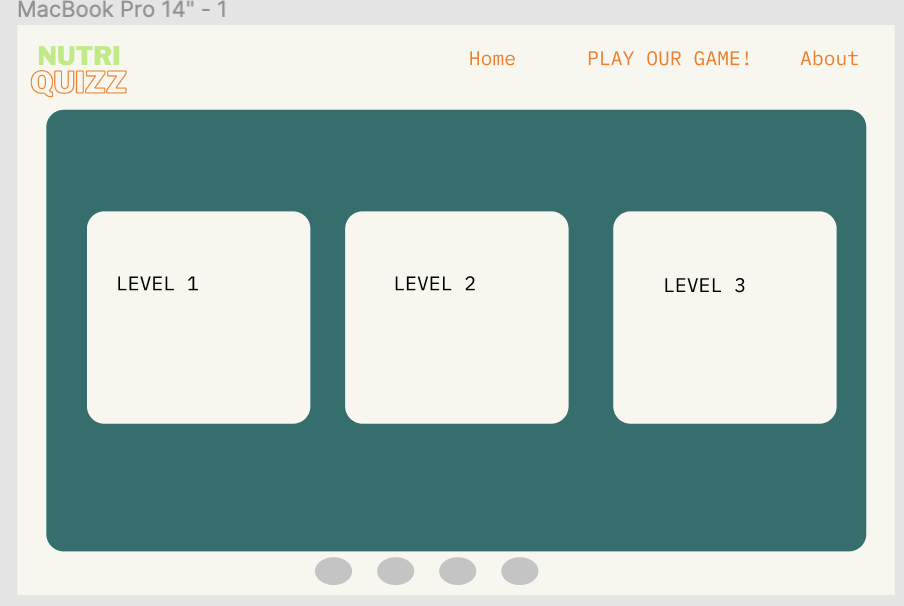

# NutriQuizz
 

### NutriQuizz is an interactive quiz to check your nutrition knowledge. It is made for people interested in health and nutrition who are also passionated about quizzes and interactive online games. 

Our users will be able to get instructions on how to play the quiz and also to test their knowledge as well as submit their score and check other users' scores. 

 

# Features

# UX

# 1.STRATEGY 

## Project goals:
The primary goal of NutriQuiz is to enable its users to check their nutrition knowledge level, submit their score and access other high scores. 

## User stories:

As a user, I want to:
* Play the quiz.
* Be able to see the High Scores page. 
* Be able to see the final score in the end page. 
* Be able to submit my score. 
* Access the website's social media pages easily by clicking on the footer icons. 
* Be able to access "How to play" section on the page home. 
* Be able to click a button to scroll up. 

 ## User goals:
The user is looking for:
* An interactive quiz to check their nutrition knowledge level, answer to nutrition related questions, get their level and check out other scores in the high scores page. 

The target user is:
* Age: 18+
* People interested in a healthy lifestyle, nutrition and healthy food.
* People passionate of quizzes and interactive online games. 

## Site owner's goals:
* Provide a free quiz with nutrition questions.
* Gather usernames with scores. 
* Provide feedback on how the user passed the quiz. 
* Provide clear "how to play" steps for a pleasant user experience. 

# 2. SCOPE
The features of NutriQuiz will include:

* The ability to answer the questions and pass the quiz .
* The ability to submit your username and score.
* The ability to get feedback on your nutrition knowledge.
* The ability to access a step by step "how to play" instruction. 
* The ability to access social media accounts clicking on the footer icons. 
* The ability to scroll up the page by clicking on a scroll-to-top button. 
* The ability to turn on/off background music. 

# 3. STRUCTURE

Responsive on DESKTOP, TABLET and MOBILE screens.

* ## Navbar: 
The navbar includes links to the below sections:
Home, How to Play, High Scores, Play button.
On mobile screens, the navbar turns into a hamburger menu. 

* ##  Home section: 
Home section includes an intro page, how to play step by step section and the High score section which redirects you to the high scores page. It also contains scroll down animations and a scroll-up button at the end. 

* ## How to Play section: 
This section includes a step-by step instruction on how to play our quiz. It is animated. 

* ## High scores section:
This section includes a button which directs you to the high scores page. The High score page includes top 10 users with the highest score.

* ## Play button 
The play button is present in the navigation bar as well as other two sections on the home page. On tablet screens, the play button in the navigation bar is not displayed. 

* ## Quiz page
This page includes a section with score and question number info, the question section and answer options section. It also includes a toggle to turn off/on the background music. Each correct answer is turning green when clicked and the wrong one is turning red. When answering incorrectly, the user does not get feedback and this is done on purpose, to motivate the users to explore more about nutrition and look for extra information. 

* # End page 
This page includes the score you get as well as a button to go back and retake the quizz if the user is unhappy with their score.  

# 4. SKELETON 

## Mockups were created using Figma. 

### Initial Wireframes 
 
 

# 5. SURFACE 

 ## Color 
* The color palette was selected on the website below:

https://colorhunt.co/palette/b6eb7af7f7eefb781317706e

 ## Typography

* LibreFranklin Black is used as the main font and QuickSand is the font used for the paragraphs. For inspiration, I used the website below. 

https://www.fontpair.co

 ## Audio

# TESTING

## Home:
### MOBILE

### DESKTOP

## Quiz:
### MOBILE

### DESKTOP

## End page:
### MOBILE

### DESKTOP

## High Score Page:
### MOBILE

### DESKTOP

https://webdesign.tutsplus.com/tutorials/animate-on-scroll-with-javascript--cms-36671

Bugs
The main video of the screen was positioned a few pixels from the left of the screen and I eventually figured that there is an automatic margin which needs to be set to 0 in order to avoid issues like these.

When deployed, I would get an error that github cannot find the files. The problem was caused by choosing the wrong option when deploying the website to github pages: files instead of root.

I was using % for font and positioning, instead of using pixels/rem. It caused some issues as I always needed to change the font size for various screen sizes.

Initially, for breakfast, lunch and dinner pages, I used a different flexbox for each recipe and the code was way too long. It took me some time to realize that I can use the same class for each recipe and only write a few lines to style all 3 pages.

Unfixed bugs
I have noticed that at some instances, the main video is not responsive on iOS. I did some research and figured that iOS does not acces mp4 files. Therefore, I decided to convert my mp4 file to a mpeg file but the video was not responsive at all. I figured this issues after my call with the mentor and unfortunately, I could not fix it.
Deployment
EAT+FIT was deployed to GitHub pages.

The steps to deploy are as follows:

In the GitHub repository, navigate to the Settings tab
Scroll down the Settings page until you locate the "GitHub Pages" Section.
Under "Source", click the drop down called "None" and select "Main Branch".
Link: https://nikkibudeanu.github.io/my-first-project/index.html

Credits
Content:
Recipes were taken from the websites below:

http://recipeofhealth.com/recipe/oladi-russian-pancakes-320811rb
https://loseweightbyeating.com/avocado-toast-recipes/
https://www.healthline.com/nutrition/overnight-oats-recipes#1.-Basic-overnight-oats
https://kaynutrition.com/edamame-salad/
https://www.yummly.com/recipes/quinoa-salad-low-calorie
https://www.bbcgoodfood.com/recipes/italian-style-stuffed-aubergines
https://www.verywellfit.com/creamy-spicy-pumpkin-soup-2242417
https://www.quorn.co.nz/recipes/vegan-nuggets-salad-bowl
Media :
All images/videos were taken from Pexels.

Code :
The box shadow code was taken from the website below:

https://getcssscan.com/css-box-shadow-examples

Acknowledgements
My mentor Akshat Garg for continuous assesement and insightful resources and feedback.
About
No description, website, or topics provided.
Topics
Resources
 Readme
Stars
 0 stars
Watchers
 1 watching
Forks
 1 fork
Releases
No releases published
Create a new release
Packages
No packages published
Publish your first package
Environments 1
 github-pages Active
Languages
HTML
77.4%
 
CSS
22.6%
