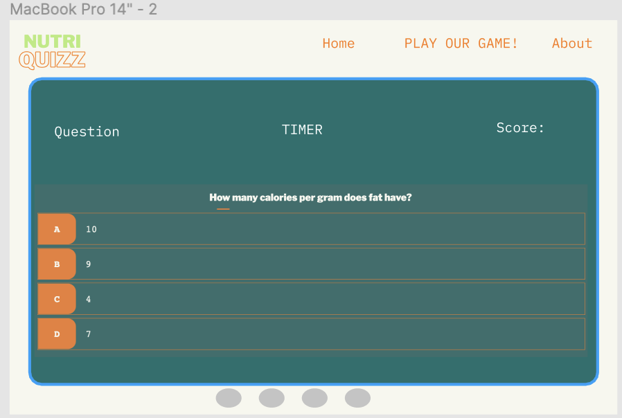

# NutriQuizz
 

### NutriQuizz is an interactive quiz to check your nutrition knowledge. It is made for people interested in health and nutrition who are also passionated about quizzes and interactive online games. 

Our users will be able to get instructions on how to play the quiz and also to test their knowledge as well as submit their score and check other users' scores. 

 

# Features
Responsive on DESKTOP, TABLET and MOBILE screens.

* # Home Page
The main page of NutriQuiz consists of a navigation bar, a main page with an intro message, the "how to play" section, the "high scores" section and the footer. When landing on NutriQuiz's main page, you will be welcomed by an animated message which will introduce you to our main purpose. 

Link: https://nikkibudeanu.github.io/NutriQuizz/index.html

 

* # Navigation Bar
The navigation bar is featured on all pages. The navigation bar will allow the user to easily navigate from page to page across all devices without  using the ‘back’ button. It includes links to the quiz, high score page and a logo created by me in Canva. It turns into a hamburger menu on phone screens.

 
 
 

* # Logo
The logo was created in Canva and I used the same font family as the headings "LibreFranklin Black". It is clickable and brings you to the home page.

* # How to play section
This section is animated using CSS and Javascript. It slides from left and right while scrolling and it includes an instruction on how to play the quiz. It is the second section on the home page. I got inspired  here to create the animation. https://webdesign.tutsplus.com/tutorials/animate-on-scroll-with-javascript--cms-36671
 
 

* # High scores section
This section is also part of the main page and it includes a button which redirects you to the high scores page where you will find our top 5 users with the highest scores. 

 
 

* # Back to top button
This button is present at the end of the home page and its role is to scroll up to the top of the page with a single click.

 

* # Footer
The footer includes 4 clickable icons which will redirect you to our social media chanels. 

 

* # The Quiz Page
The quiz page contains the music toggle, progress information section, the question and answer options section. 
 

* # Play Button
This button enables you to access our quiz. It is present on the intro section, end page, how to play section and also the navigation bar. 
 
 

* # End Page

This page will display your score and you will also be able to submit it along with your username. It also includes a "play button" to retake the quizz if you are not happy with your score. 
 

# UX

# 1.STRATEGY 

## Project goals:
The primary goal of NutriQuiz is to enable its users to check their nutrition knowledge level, submit their score and access other high scores. 

## User stories:

As a user, I want to:
* Play the quiz.
* Be able to see the High Scores page. 
* Be able to see the final score in the end page. 
* Be able to submit my score. 
* Access the website's social media pages easily by clicking on the footer icons. 
* Be able to access "How to play" section on the page home. 
* Be able to click a button to scroll up. 
* Turn the background music on and off. 

 ## User goals:
The user is looking for:
* An interactive quiz to check their nutrition knowledge level, answer to nutrition related questions, get their level and check out other scores in the high scores page. 

The target user is:
* Age: 18+
* People interested in a healthy lifestyle, nutrition and healthy food.
* People passionate of quizzes and interactive online games. 

## Site owner's goals:
* Provide a free quiz with nutrition questions.
* Gather usernames with scores. 
* Provide feedback on how the user passed the quiz. 
* Provide clear "how to play" steps for a pleasant user experience. 

# 2. SCOPE
The features of NutriQuiz will include:

* The ability to answer the questions and pass the quiz .
* The ability to submit your username and score.
* The ability to get feedback on your nutrition knowledge.
* The ability to access a step by step "how to play" instruction. 
* The ability to access social media accounts clicking on the footer icons. 
* The ability to scroll up the page by clicking on a scroll-to-top button. 
* The ability to turn on/off background music. 

# 3. STRUCTURE

Responsive on DESKTOP, TABLET and MOBILE screens.

* ## Navbar: 
The navbar includes links to the below sections:
Home, How to Play, High Scores, Play button.
On mobile screens, the navbar turns into a hamburger menu. 

* ##  Home section: 
Home section includes an intro page, how to play step by step section and the High score section which redirects you to the high scores page. It also contains scroll down animations and a scroll-up button at the end. 

* ## How to Play section: 
This section includes a step-by step instruction on how to play our quiz. It is animated. 

* ## High scores section:
This section includes a button which directs you to the high scores page. The High score page includes top 10 users with the highest score.

* ## Play button 
The play button is present in the navigation bar as well as other two sections on the home page. On tablet screens, the play button in the navigation bar is not displayed. 

* ## Quiz page
This page includes a section with score and question number info, the question section and answer options section. It also includes a toggle to turn off/on the background music. Each correct answer is turning green when clicked and the wrong one is turning red. When answering incorrectly, the user does not get feedback and this is done on purpose, to motivate the users to explore more about nutrition and look for extra information. 

* # End page 
This page includes the score you get as well as a button to go back and retake the quizz if the user is unhappy with their score.  

# 4. SKELETON 

## Mockups were created using Figma. 

### Initial Wireframes 

The project initially was meant to have 3 levels. However, I could not figure out how to efficiently link the levels through Javascript and I ended up only doing one level. This is why, my initial wireframes were the below ones. 

 
 

# 5. SURFACE 

 ## Color 
* The color palette was selected on the website below:

https://colorhunt.co/palette/b6eb7af7f7eefb781317706e

 ## Typography

* LibreFranklin Black is used as the main font and QuickSand is the font used for the paragraphs. For inspiration, I used the website below. 

https://www.fontpair.co

 ## Audio
The background music in the quiz page was downloaded from https://www.bensound.com/ . The sound is called "sweet". 

# TESTING
* I tested NutriQuiz on various browsers: Safari, Google Chrome, Mozilla Firefox.
* I confirmed that all the website features are easy to understand and readable.
* I confirmed that the navigation bar and footer works on different screen sizes.
* I passed the Lighthouse Developper tool's report with more than 90% for all pages.
* I shared the deployed page with a couple of colleagues from the Code Institute to get feedback. 

## Home:
### MOBILE

### DESKTOP

## Quiz:
### MOBILE

### DESKTOP

## End page:
### MOBILE

### DESKTOP

## High Score Page:
### MOBILE

### DESKTOP

# Validator Testing

* ## HTML
No errors were returned when passing through the official W3C validator
* ## CSS
No errors were found when passing through the official (Jigsaw) validator
* ## JavaScript

# Bugs

# Unfixed bugs

# Deployment
 ## NutriQuiz was deployed to GitHub pages.

The steps to deploy are as follows:

* In the GitHub repository, navigate to the Settings tab
* Scroll down the Settings page until you locate the "GitHub Pages" Section.
* Under "Source", click the drop down called "None" and select "Main Branch".
Link: https://nikkibudeanu.github.io/NutriQuizz/index.html

# Credits
## Content:
The questions were taken from the websites below: 
* https://www.bupa.co.uk/health-information/tools-calculators/nutrition-quiz 
* https://www.healthline.com/nutrition/biggest-lies-of-nutrition#3.-Breakfast-is-the-most-important-meal-of-the-day

## Code :
The box shadow code was taken from the website below:

https://getcssscan.com/css-box-shadow-examples

The play button was inspired from the website below, with some custom adjustments. 
https://getcssscan.com/css-buttons-examples 

# Acknowledgements
My colleague Harry from C

